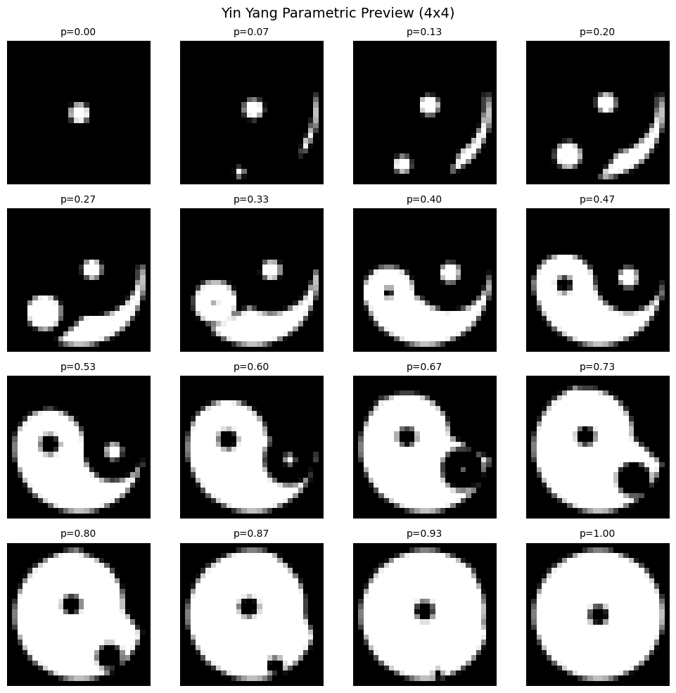
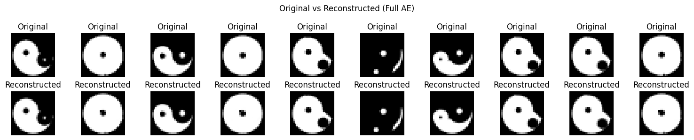
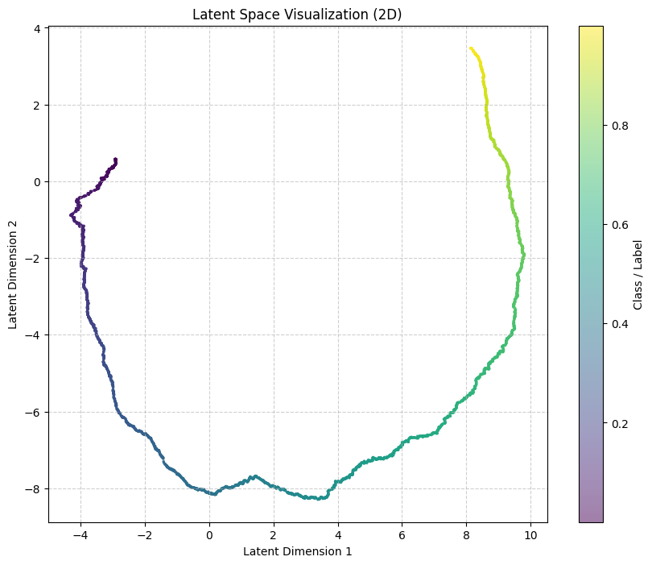
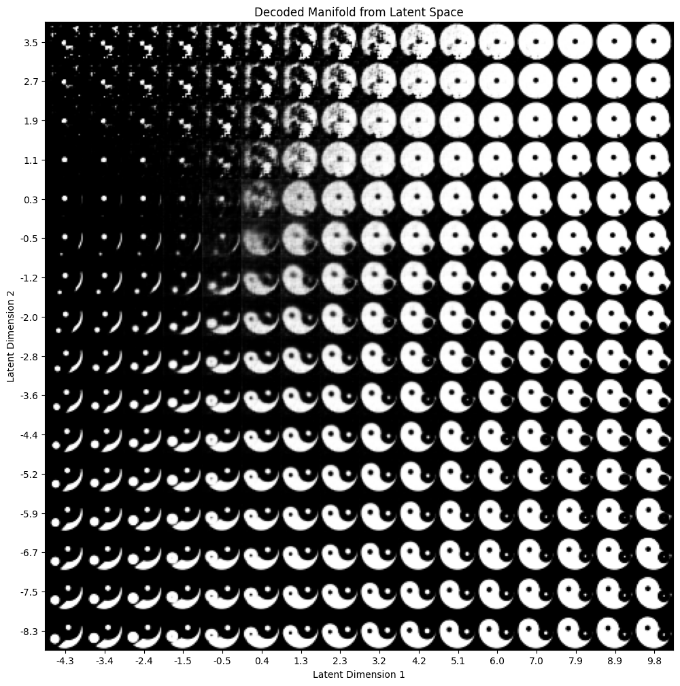
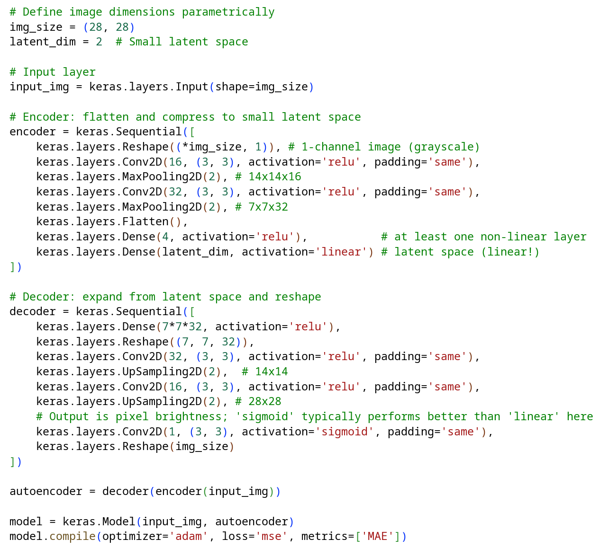
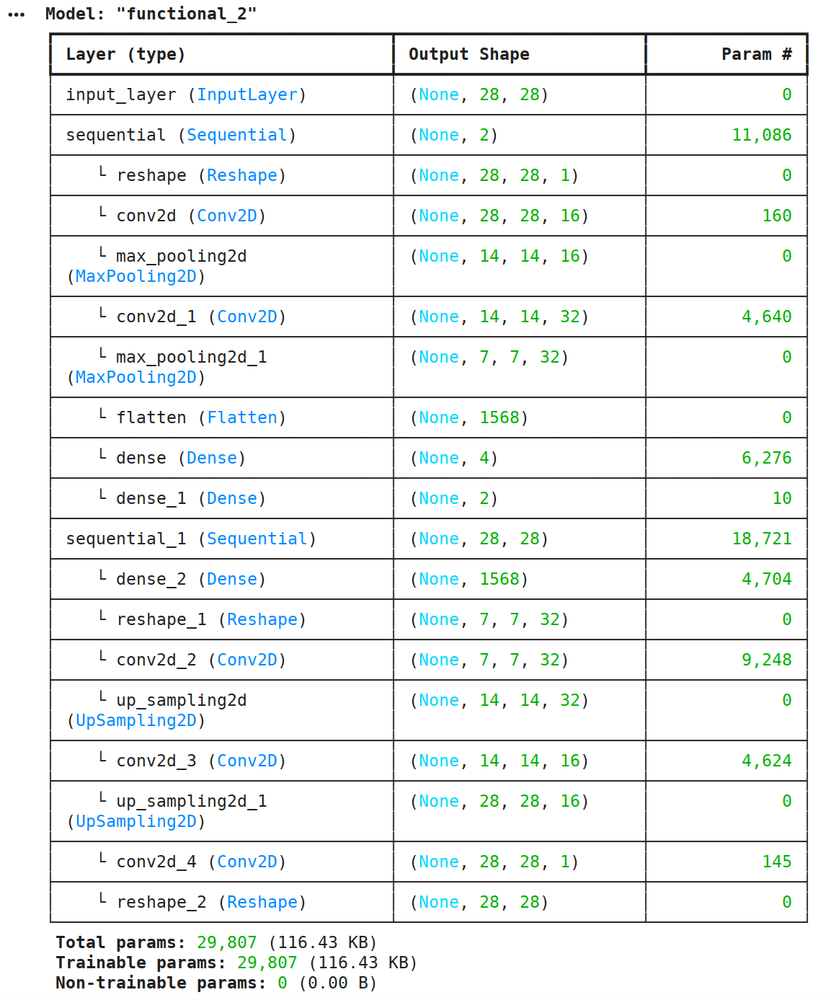
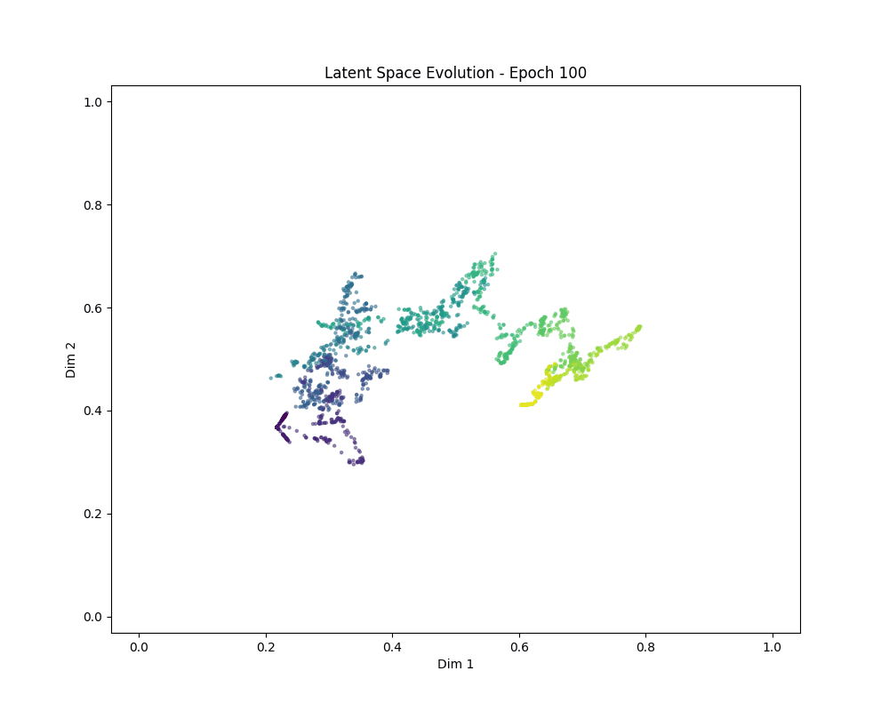

# Parametric Yin Yang Dataset

## Overview

The primary objective of this project is to provide a simple, yet interesting dataset for testing autoencoder concepts and generative models. It is an alternative to the boring MNIST digits dataset. Perfect for educational purposes in machine learning classes.

The dataset consists of parametrically generated Yin Yang symbols. The generation algorithm (`yinyang.py`) was vibe-coded using Gemini 3. 

## What makes this dataset interesting?

Unlike typical datasets where images belong to distinct, isolated classes (like digits 0-9), these Yin Yang images are generated using a **single continuous parameter** ranging from `0.0` to `1.0`. 

Because every visual variation in the dataset is generated by this single scalar (representing the "phase" or rotation/state of the Yin Yang), the dataset can be utilized for:
- regression analysis,
- autoencoder representation learning,
- continuous manifold learning and visualization.

## Example Usage (Notebooks)

The repository includes three separate Jupyter notebooks that demonstrate how to generate the data and apply machine learning models:

1. **[01_preview.ipynb](notebooks/01_preview.ipynb)** or [Google Colab](https://drive.google.com/file/d/1_nOnzi5xMLrjMVWYFEFEfv0zkoQCM6D7/view?usp=sharing): a quick preview showing how to generate, load, and visualize the dataset,
2. **[02_full_autoencoder.ipynb](notebooks/02_full_autoencoder.ipynb)** or [Google Colab](https://drive.google.com/file/d/1PSAx2yLC0224r1nHJxLPaPV3TzzlUlTf/view?usp=sharing): implementation of a standard, simple autoencoder layout,
3. **[03_small_autoencoder.ipynb](notebooks/03_small_autoencoder.ipynb)** or [Google Colab](https://drive.google.com/file/d/1ejZ3gQE_hhZ_plJU_6u8ZhythPtNTjt9/view?usp=sharing): a deeper analysis focusing on a **bottleneck autoencoder** with a restricted latent space.

## Deep Dive: The Bottleneck Autoencoder

The `03_small_autoencoder.ipynb` notebook contains the core discussion and the most exciting findings of this project. 

Because the original dataset is fundamentally driven by a 1-dimensional source (a single float from 0 to 1), we naturally expected the autoencoder to achieve good reconstruction quality, even with a low-dimensional bottleneck. 

Indeed, the network easily learns to reconstruct the images with a Mean Absolute Error (MAE) of **< 0.004** for latent space as low as 2D (or even 1D). This level of error is virtually imperceptible, as it is comparable to the smallest difference in pixel brightness (assuming a standard 256-level grayscale distribution, where `1/256 ≈ 0.0039`).

However, the most unexpected and intriguing results was the spontaneous **self-regularization in the 2D latent space**.

When plotting the 2D latent representations of the input examples, the network does not simply scatter the points into a noisy 2D distribution. Instead, it natively discovers the underlying dimensionality of the data: it maps the inputs into a distinct, **continuous 1D curve** cleanly embedded within the 2D space. As expected, each time you train the network, the curve is completely different, but it always remains a continuous 1D curve.

*(Notice how the representations form a continuous, 1D trajectory matching the 1D input parameter)*

To further illustrate this, a **Decoded Manifold** was created. This visualization was built by sampling a uniform 2D grid of coordinates across the latent space and passing each coordinate directly through the decoder network. 

As a result, only the coordinates that lie exactly along the learned 1D curve decode into correct Yin Yang symbols. When we force the decoder to generate images from coordinates outside of this path (out-of-distribution regions), it produces illegible, blurred or distorted artifacts. **This could be considered as a hallucination of the network**. This perfectly visualizes the network's bounded knowledge - it simply does not know how to map regions outside its learned 1D manifold.

### Model Architecture

For the sake of simplicity and ease of use, the autoencoder model was implemented using the high-level **Keras** interface. Modern Keras can run on top of arbitrary backends like TensorFlow, PyTorch, or JAX.

#### Key Architectural Observations

During the experiments, several important design choices became apparent:
- **Linear Latent Space**: the bottleneck layer should use a `linear` activation, restricting the latent representations even from one side (e.g., using `ReLU`) led to higher reconstruction error, 
- **Pre-bottleneck Non-linearity**: there must be at least one non-linear layer (here, a `Dense` layer with 4 neurons and `ReLU` activation) directly before the linear latent bottleneck, without it, the model's performance drops,
- **Flattening via Convolution**: the last convolutional layer in a decoder uses a single filter, this effectively "flattens" the preceding multi-channel feature maps into a single channel image, which is a typical in such a architecture,
- **Decoder Output Activation**: intuitively, one might assume the decoder's final output should be `linear`, given it predicts raw pixel brightness, however, our experiments showed that a linear output causes the model to struggle with "overshooting" (predicting values outside $[0, 1]$), using a `sigmoid` activation naturally bounds the output to $[0, 1]$ and surprisingly produced the best results (even outperforming a constrained hard-sigmoid or similar).

#### Model Size and Compression Ratio

The autoencoder consists of approximately **30,000 parameters** total (roughly 11k in the encoder and 19k in the decoder). This leads to interesting observations:
- given that the dataset contains 10,000 purely generated examples, the mathematical implication is that about **2 coefficients per image on average are enough to perform a reconstruction** (since the decoder is the part mapping representations to images),
- it is quite remarkable that these ~2 coefficients are sufficient to perfectly reproduce a $28 \times 28$ image consisting of 784 pixels, this translates to an effective **data compression ratio of roughly 400x**,
- this extreme compression is possible because the Yin Yang images are highly self-similar internally (simple geometrical patterns) and there is a continuous, smooth transition from one image to another across the dataset,
- it is worth noting that no significant effort was made to minimize or optimize the size of this encoder, it is certainly possible to build an even smaller model, which would push this compression ratio even higher!

### Future Ideas

- improving the Yin Yang generative script to produce images with fewer "raw edges", even though they are currently sufficient for this experiment,
- trying to reduce the size of the autoencoder, as it seems it could easily be 2-3 times smaller in terms of parameter count,
- taking advantage of the fact that the transition between images goes from a dark to a light background, meaning the entire encoder could potentially just be a simple (weighted) average of the whole image (a single neuron), while keeping a convolutional decoder which is highly efficient for modeling images,
- experimenting with regulating the latent space to enforce specific topological properties, such as forming a straight continuous line, a perfect circle, or a line with a uniformly distributed brightness,
- bringing your own ideas and experimenting freely :)

### Bonus: Evolution of the Latent Space

To better visualize how the neural network "discovers" this underlying parameter, the animated "evolution" of the 2D latent space was created during the training process. 

Initially, the embeddings are a tangled, chaotic knot. As the network learns the true 1-dimensional topological nature of the dataset parameter, the curve elegantly unwinds, straightens out, and self-organizes into a continuous manifold.

What is worth notice, the latent space was not regularized by any means. No VAE, no KL divergence, no additional loss terms. Just a plain autoencoder with simple MSE loss function.  

